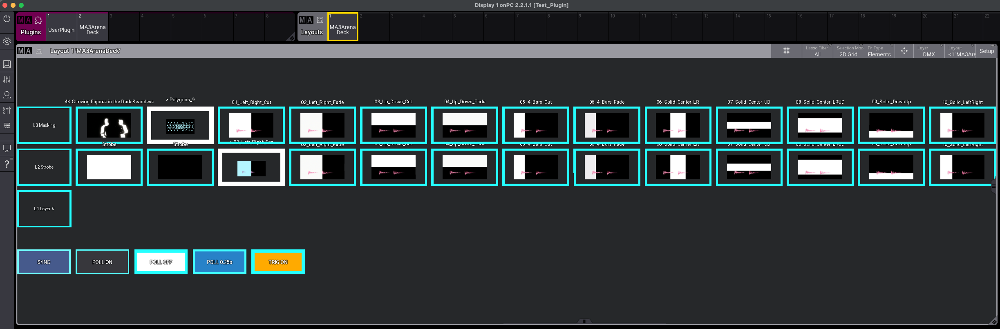

# MA3ArenaDeck

**Resolume composition grid for grandMA3**

MA3ArenaDeck mirrors your Resolume Arena / Avenue clip deck on a grandMA3 layout: thumbnails, live “what’s playing” highlights, and optional tap-to-trigger control from the console.

Ideal for busking, hybrid lighting + video shows, and keeping the media operator’s deck visible (and optionally playable) on the lighting surface.

A grandMA2 Layout View port lives in [`ma2/`](ma2/README.md).



---

## Features

- Builds a **layout grid** that matches your Resolume layers and columns (layer 1 at the bottom, like Resolume)
- Imports **clip thumbnails** into Images / Appearances
- **POLL** mode highlights the currently connected (playing) clips in cyan
- **TRIG** mode lets you tap a clip on the layout to fire it in Resolume via the REST API
- On-layout controls: **SYNC**, **POLL ON / OFF**, **poll interval**, **TRIG ON / OFF**
- Setup dialog for host, port, layout slot, and pool indexes (values are remembered)

---

## Requirements

| Software | Notes |
| --- | --- |
| **grandMA3** | onPC or console (developed against ~2.2 / 2.3+) |
| **Resolume Arena or Avenue** | with **Webserver & REST API** enabled |
| **Network path** | MA3 machine must reach the Resolume machine (same PC, LAN, or routed network) |

Lua HTTP modules shipped with grandMA3 (`http`, `ltn12`, `json`) are used; no extra installs on the console.

---

## Network & Resolume webserver (important)

MA3ArenaDeck talks to Resolume over **HTTP**. The grandMA3 system must be able to open a TCP connection to Resolume’s webserver address and port.

1. On the Resolume machine: **Preferences → Webserver**
2. Enable **Webserver & REST API**
3. Note the **Listen Address** and **Listen Port**
4. From the MA3 machine, confirm you can open the Resolume web UI in a browser, e.g. `http://<resolume-ip>:<port>/`

Official Resolume documentation:

- [REST API & Webserver](https://www.resolume.com/support/en/restapi)

### Port conflict with grandMA3

Resolume’s default webserver port is often **8080**. grandMA3 also commonly uses **8080**.

If both run on the **same computer**, change Resolume’s listen port (for example to **8090**) and enter that port in MA3ArenaDeck’s setup dialog. The plugin default is Resolume’s usual `127.0.0.1:8080` — only change it when 8080 is already taken (e.g. by grandMA3).

### Different machines

- Put Resolume’s **LAN IP** in MA3ArenaDeck (not only `127.0.0.1` — that always means “this machine”)
- Allow the port through the OS firewall on the Resolume PC
- Both machines must be on a network that can route to each other (same subnet is simplest)

---

## Install

1. Copy this folder into your grandMA3 plugins library as:

   `…/gma3_library/datapools/plugins/MA3ArenaDeck/`

2. Files expected:

   | File | Role |
   | --- | --- |
   | `MA3ArenaDeck.xml` | Plugin definition (import this) |
   | `MA3ArenaDeck.lua` | Plugin code |
   | `LICENSE` | MIT license |
   | `README.md` | This document |

3. In grandMA3: **Import** `MA3ArenaDeck.xml` into the **Plugin** pool.

4. On the ComponentLua object, set:

   - **Installed** = **Yes**
   - **FileName** = `MA3ArenaDeck.lua`
   - **Path** = `MA3ArenaDeck` (must match the folder name under `datapools/plugins`)

5. Keep the plugin **external** (`Installed = Yes`). Pasting the full Lua into the showfile editor can hit a size limit and will not update from disk.

6. After changing the `.lua` file on disk, run:

   `ReloadAllPlugins`

---

## Quick start

1. Enable the Resolume webserver (see above) and load a composition with clips.
2. Tap the **MA3ArenaDeck** plugin in the Plugin pool → setup dialog opens.
3. Set **Host** / **Port** (and layout / pool starts if you need non-defaults) → **Sync**.
4. Open **Layout** (default: Layout 1, labelled *MA3ArenaDeck*).
5. Tap **POLL ON** to follow playing clips, or **TRIG ON** to also fire clips from the layout (poll starts automatically with trigger).

---

## Layout controls

| Button | Action |
| --- | --- |
| **SYNC** | Stops polling, re-fetches the composition, rebuilds the layout and media |
| **POLL ON** | Starts status polling; playing clips get a cyan frame |
| **POLL OFF** | Stops polling |
| **POLL x.xxs** | Cycles poll interval (`0.10` → `0.25` → `0.50` → `1.00` → `2.00` s) |
| **TRIG ON / OFF** | When **ON**, tapping a clip cell triggers that clip in Resolume; poll is started so highlights stay in sync |

Playing clips: thicker **cyan** border (and optional name prefix `>`). Idle clips: white border.

---

## Setup dialog options

Opened when you run the plugin from the pool (no argument):

| Field | Meaning |
| --- | --- |
| Host | Resolume IP or hostname (`127.0.0.1` if on the same PC) |
| Port | Resolume webserver port |
| Layout Index / Name | Where the grid is built |
| Image / Appearance / Macro start | Pool indexes used for generated objects |
| Poll interval | Default polling period |
| Fetch thumbnails | Import PNG thumbs from Resolume |
| Only clips with thumbnail | Skip empty / default slots |
| Highlight previewing | Also treat “Previewing” as active |

Use **Sync** to save and rebuild, **Save Only** to store settings without rebuilding, or **Cancel**.

---

## Command-line / macro arguments

Useful if you call the plugin from your own macros:

| Argument | Effect |
| --- | --- |
| *(none)* / `setup` | Setup dialog, then sync if confirmed |
| `sync` | Full sync (no dialog) |
| `monitor` | Start poll loop |
| `stop` | Stop poll loop |
| `interval` | Cycle poll interval |
| `trigtoggle` | Toggle tap-to-trigger |

Example:

```text
Plugin "MA3ArenaDeck" "sync"
Plugin "MA3ArenaDeck" "monitor"
```

---

## Tips

- Run **SYNC** after you change the Resolume composition (new clips, rearranged deck).
- Keep **POLL ON** (or **TRIG ON**) while performing if you want live highlights.
- Pool indexes default from **200** upward — change them in setup if those slots are already used in your show.
- If sync fails, check System Monitor for HTTP errors, then verify the webserver URL in a browser from the MA3 machine.

---

## Troubleshooting

| Symptom | What to check |
| --- | --- |
| Setup / sync cannot reach Resolume | Webserver enabled; host/port; firewall; browser test from the MA3 PC |
| Works on Resolume PC but not from console | Use LAN IP, not `127.0.0.1`; same network / routing |
| Port already in use / odd HTTP failures on one machine | Change Resolume off **8080** (MA conflict); set the new port in MA3ArenaDeck |
| Plugin changes not loading | `Installed = Yes`, external `.lua`, then `ReloadAllPlugins` |
| Layout buttons missing / wrong | Run **SYNC** once after install or after changing macro start index |
| Tap does nothing | **TRIG ON**; then **SYNC** once so clip fire macros are rebuilt |

---

## Privacy & safety

- MA3ArenaDeck only contacts the Resolume host/port you configure.
- Trigger mode sends clip **connect** commands to Resolume — disable **TRIG** for monitor-only operation.
- Generated Images, Appearances, Macros, and Layout content live in your showfile / pools; review pool start indexes before large shows.

---

## License

This project is licensed under the [MIT License](LICENSE).

---

## Credits

Built for grandMA3 + Resolume Arena/Avenue workflows using the [Resolume REST API](https://www.resolume.com/support/en/restapi).
